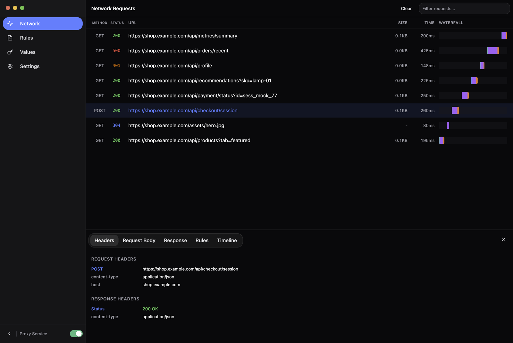
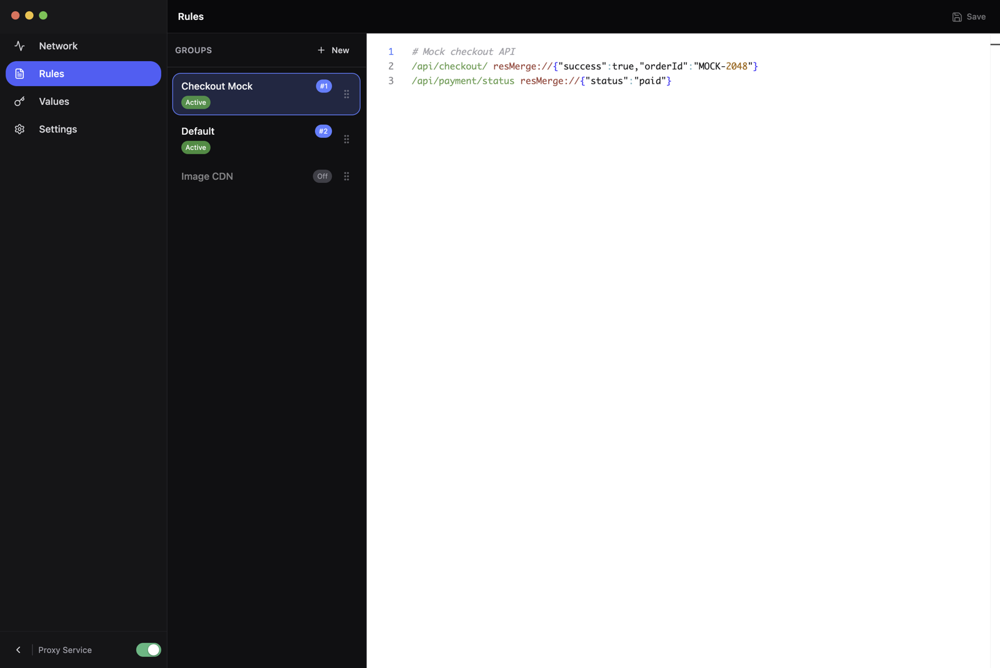
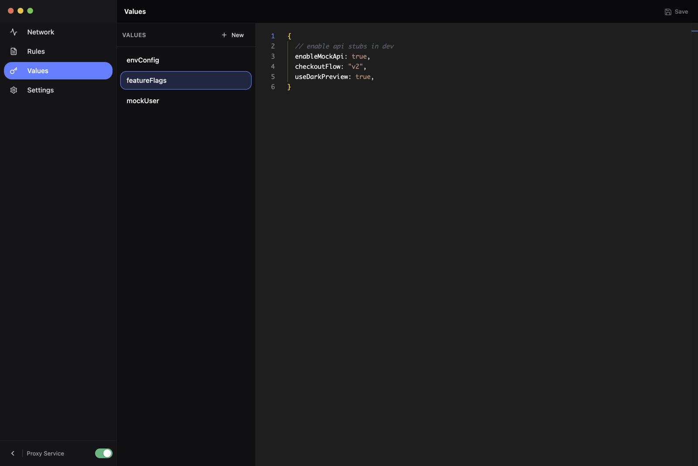
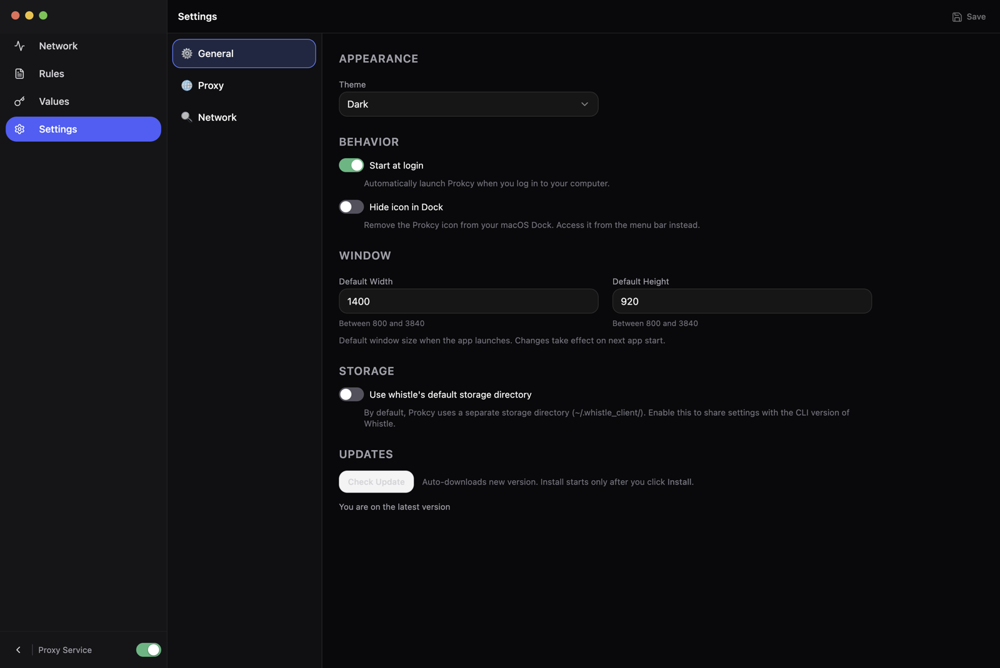

<div align="center">
  

  <h1>Prokcy</h1>
  <p><strong>跨平台 HTTP/HTTPS/WebSocket 网络调试代理 GUI</strong></p>
  <p>基于 <a href="https://github.com/avwo/whistle">whistle</a> 引擎，使用 Electron + React + TailwindCSS + Monaco Editor 构建的现代化桌面调试工具。</p>

  <p>
    <a href="https://github.com/Yaphet2015/Prokcy/actions/workflows/ci.yml"></a>
    <a href="https://github.com/Yaphet2015/Prokcy/actions/workflows/build.yml"></a>
    <a href="https://github.com/Yaphet2015/Prokcy/releases"></a>
    <a href="./LICENSE"></a>
    <a href="https://github.com/Yaphet2015/Prokcy/releases"></a>
    <a href="https://github.com/Yaphet2015/Prokcy/stargazers"></a>
    
  </p>

  <p>
    <a href="./README-en_US.md">English</a>
    &nbsp;·&nbsp;
    中文
  </p>
</div>

---

Prokcy 是一款跨平台桌面网络调试代理工具，提供现代化 GUI 界面来捕获、检查和操控 HTTP/HTTPS/WebSocket 网络请求。底层基于 [whistle](https://github.com/avwo/whistle) 代理引擎，上层构建了全新的风格界面。

支持平台：**macOS**（Apple Silicon / Intel）· **Windows** · **Linux**（Fedora / Ubuntu）

> 若运行环境无图形界面（如服务器或特殊设备），请改用 [whistle 命令行版本](https://wproxy.org/whistle/)。

## 📑 目录

- [✨ 核心特性](#-核心特性)
- [📸 界面预览](#-界面预览)
- [🔧 核心功能](#-核心功能)
- [📦 安装](#-安装)
- [🚀 快速上手](#-快速上手)
- [📐 规则详解](#-规则详解)
- [快捷键](#快捷键)
- [❓ 常见问题](#-常见问题)
- [🙏 鸣谢](#-鸣谢)
- [⭐ Star History](#-star-history)
- [📄 License](#-license)

## ✨ 核心特性

- 🌐 **多协议抓包** — HTTP / HTTPS / WebSocket，实时捕获经过代理的全部流量
- 🎨 **现代化 GUI** — 瀑布流时间线 + Monaco 编辑器 + 自定义 Whistle 语法高亮
- ✏️ **强大规则系统** — 兼容 whistle 规则语法，支持转发 / Mock / 修改请求，多分组按优先级叠加生效
- 🗂 **Values 键值存储** — JSON5 格式，可在规则中引用
- 🎯 **灵活过滤** — 按域名 / 路径 / 通配符过滤请求列表
- 🔄 **自动更新** — 内置版本检查与自动升级
- 🚀 **跨平台** — macOS、Windows、Linux 一致的体验
- 📦 **开箱即用** — 一键安装根证书与系统代理

## 📸 界面预览

| Network | Rules |
|--------|-------|
|  |  |

| Values | Settings |
|--------|----------|
|  |  |

## 🔧 核心功能

### Network — 网络抓包

瀑布流时间线 + 请求检查器的分屏布局，实时捕获经过代理的所有网络请求。

- **瀑布流时间线**：每个请求以水平条形展示，按阶段着色（DNS 蓝色、TCP 青色、TLS 绿色、TTFB 紫色、Download 橙色）
- **请求检查器**：支持 Headers（含 Cookie 与 Raw HTTP）、Body、Response、Timeline、Rules 多个标签页，JSON 自动语法高亮
- **虚拟化列表**：大量请求下依然流畅，列表表头（Method / Status / URL / Size / Time / Waterfall）与内容对齐
- **请求过滤**：在 Settings → Network 中配置过滤规则，支持域名、路径和通配符匹配

### Rules — 规则编辑

Monaco Editor + 规则分组面板的双栏布局，使用 whistle 规则语法来转发、mock 或修改请求。

- **自定义语法高亮**：为 whistle 规则语法定制了 Monaco 语言定义，协议关键字、模式匹配、注释均有独立着色
- **规则分组管理**：支持创建、重命名、删除分组，拖拽排序调整优先级
- **多组同时生效**：可启用多个规则组，优先级按列表从上到下（`#1` > `#2` > ...）
- **快捷键**：`Cmd/Ctrl+S` 保存，`Cmd/Ctrl+/` 切换注释

### Values — 键值存储

双栏布局（左侧键列表 + 右侧 Monaco 编辑器），管理 JSON5 格式的键值对数据，可在规则中引用。

- **JSON5 编辑**：支持注释和尾随逗号
- **自动保存**：编辑后 300ms 自动保存到后端
- **快捷键**：`Cmd/Ctrl+N` 新建、`Cmd/Ctrl+D` 删除、`Cmd/Ctrl+Shift+R` 重命名、`Cmd/Ctrl+F` 搜索

### Settings — 应用设置

分类式设置面板，包含以下三个类别：

| 类别 | 配置项 |
|------|--------|
| **Proxy** | 代理端口、Socks 端口、监听地址、HTTP Header 上限、请求列表上限、代理鉴权（用户名/密码）、Bypass 白名单、系统代理开关 |
| **Network** | 请求过滤规则（支持通配符，按域名/路径/URL 匹配） |
| **App** | 存储目录切换、主题（跟随系统/亮色/暗色）、开机自启、隐藏 Dock 图标 |

## 📦 安装

请根据你的操作系统选择对应的安装步骤。最新版本请前往 [Releases](https://github.com/Yaphet2015/Prokcy/releases) 下载。

<details>
  <summary>macOS</summary>

##### 1. 选择正确的安装包

根据你的 Mac 处理器类型选择对应版本：
- Apple Silicon 芯片 (M系列) → 下载 ARM 64位版本：[Prokcy-vx.y.z-mac-arm64.dmg](https://github.com/Yaphet2015/Prokcy/releases)
- Intel/AMD 芯片 → 下载 x86_64 版本：[Prokcy-vx.y.z-mac-x64.dmg](https://github.com/Yaphet2015/Prokcy/releases)

##### 2. 安装步骤

1. 下载完成后，双击下载的 `.dmg` 文件
2. 将 Prokcy 图标拖拽至 Applications 文件夹
3. 如遇以下情况：
   - 提示 "应用已存在" → 选择 "覆盖"
   - 无法覆盖 → 请先退出正在运行的 Prokcy

##### 3. 安全提示

当前 GitHub Release 提供的 macOS 安装包是**未签名**构建，不是 Apple notarized 版本。
- 首次打开时，如果看到“无法验证开发者”，请在 Finder 中右键应用并选择“打开”
- 如果看到 “damaged”，通常说明拿到的是旧的 ad-hoc 签名产物；请重新下载新版本发布包

某些企业安全软件可能误报，建议：
- 首次运行时选择 "允许" 操作
- 如有持续拦截，请联系IT部门将 Prokcy 加入白名单
</details>

<details>
  <summary>Windows</summary>

##### 1. 下载安装包

根据你的权限需求选择适合的版本：

- 【推荐】标准版（需管理员权限）：[Prokcy-vx.y.z-win-x64.exe](https://github.com/Yaphet2015/Prokcy/releases)
    > 支持完整功能，包括伪协议 (`whistle://client`)
- 用户版（无需管理员权限）：[Prokcy-user-installer-vx.y.z-win-x64.exe](https://github.com/Yaphet2015/Prokcy/releases)
    > 功能限制：不支持伪协议调用

##### 2. 运行安装程序

双击下载的安装包后，你可能会看到以下安全提示，请按顺序操作：

1. 用户账户控制提示 → 点击 "是" 继续安装
2. 安装向导界面 → 按照提示逐步完成
</details>

<details>
  <summary>Linux（Fedora/Ubuntu）</summary>

本客户端目前支持 Fedora 和 Ubuntu 两个 Linux 发行版。

下载安装包：
- Intel/AMD 64位（x86_64）：[Prokcy-vx.y.z-linux-x86_64.AppImage](https://github.com/Yaphet2015/Prokcy/releases)
- ARM 64位（arm64）：[Prokcy-vx.y.z-linux-arm64.AppImage](https://github.com/Yaphet2015/Prokcy/releases)

安装方法参考：https://zhuanlan.zhihu.com/p/517734580
</details>

## 🚀 快速上手

### 启动客户端

安装完成后，请通过以下方式启动：
1. 点击桌面上的 Prokcy 图标
2. 或通过系统应用程序菜单找到 Prokcy

### 系统证书和代理设置

1. 打开客户端顶部 `Prokcy` 菜单
2. 点击 `Install Root CA`：安装系统根证书，用于解析 HTTPS 请求
3. 开启 `Set As System Proxy`（或在 Settings → Proxy 中勾选）：设置系统代理，用于捕获系统的 Web 请求

### 顶部菜单

| 菜单项 | 说明 |
|--------|------|
| `Proxy Settings` | 打开 Settings → Proxy 设置面板 |
| `Install Root CA` | 安装 HTTPS 根证书 |
| `Check Update` | 检查新版本 |
| `Set As System Proxy` | 设置/取消系统代理 |
| `Start At Login` | 是否开机自动启动 |
| `Hide From Dock` | 是否隐藏 Dock 图标（macOS） |
| `Restart` | 重启客户端 |
| `Quit` | 退出客户端 |

## 📐 规则详解

### 规则分组与优先级

Prokcy 支持多个规则分组同时生效，优先级按列表**从上到下**排列。

#### 总开关
- `Disable All`：停用所有规则（包括 `Default` 和所有自定义分组）
- `Enable All`：重新启用规则匹配

#### 分组操作
- **单击**分组：切换到该分组进行编辑
- **双击**分组：切换启用/停用状态
- **拖拽**分组：调整优先级顺序
- 启用的分组显示优先级标记（`#1`、`#2`、...）

#### 优先级规则
1. 越靠上的分组优先级越高，靠下的作为兜底
2. 自定义分组优先于 `Default` 参与匹配
3. 同一分组内部也是从上到下匹配，先命中的生效

#### 示例

**分组间覆盖：**

```txt
Group A（#1，已启用）
example.com https://a.test

Group B（#2，已启用）
example.com https://b.test
```

请求 `http://example.com/1` 时，优先命中 Group A，最终走 `https://a.test`。

**Default 兜底：**

```txt
Group A（#1，已启用）
foo.com https://foo-group.test

Default（已启用）
foo.com https://foo-default.test
bar.com https://bar-default.test
```

- `foo.com` 命中 Group A（覆盖 Default）
- `bar.com` 在 Group A 未命中，回落到 Default

> 规则语法与 whistle 完全兼容，详细语法请参阅 [whistle 规则文档](https://wproxy.org/whistle/rules/)。

## 快捷键

| 快捷键 | 功能 | 适用范围 |
|--------|------|----------|
| `Cmd/Ctrl + S` | 保存 | Rules / Settings |
| `Cmd/Ctrl + /` | 切换注释 | Rules |
| `Cmd/Ctrl + N` | 新建 | Values |
| `Cmd/Ctrl + D` | 删除 | Values |
| `Cmd/Ctrl + Shift + R` | 重命名 | Values |
| `Cmd/Ctrl + F` | 搜索 | Values |
| `Cmd/Ctrl + ,` | 打开 Settings | 全局 |
| `Cmd/Ctrl + B` | 折叠/展开侧边栏 | 全局 |

## ❓ 常见问题

<details>
  <summary>macOS 打开时提示「无法验证开发者」或「已损坏」？</summary>

当前 macOS 安装包是**未签名**构建。若提示「无法验证开发者」，请在 Finder 中右键应用并选择「打开」；若提示「已损坏」，通常是拿到了旧的 ad-hoc 签名产物，请前往 [Releases](https://github.com/Yaphet2015/Prokcy/releases) 重新下载最新版本。
</details>

<details>
  <summary>为什么抓不到 HTTPS 请求内容？</summary>

HTTPS 解析需要信任根证书。打开顶部 `Prokcy` 菜单 → 点击 `Install Root CA` 安装系统根证书，安装后重启浏览器即可解析 HTTPS 流量。
</details>

<details>
  <summary>如何捕获系统浏览器或应用的请求？</summary>

在顶部菜单开启 `Set As System Proxy`（或在 Settings → Proxy 中勾选），Prokcy 将作为系统代理拦截系统级 Web 请求。
</details>

<details>
  <summary>企业安全软件拦截或误报怎么办？</summary>

首次运行时选择「允许」即可；若持续被拦截，请联系 IT 部门将 Prokcy 加入白名单。
</details>

<details>
  <summary>无图形界面的环境（服务器/无头设备）能否使用？</summary>

Prokcy 需要 GUI 环境。无图形界面场景请改用 [whistle 命令行版本](https://wproxy.org/whistle/)。
</details>

## 🙏 鸣谢

Prokcy 的诞生离不开以下优秀的开源项目：

- **[whistle](https://github.com/avwo/whistle)** — 核心代理引擎，本项目的基石
- **[Electron](https://www.electronjs.org/)** · **[React](https://react.dev/)** · **[TailwindCSS](https://tailwindcss.com/)** · **[Monaco Editor](https://microsoft.github.io/monaco-editor/)** — 应用与界面技术栈
- **[electron-builder](https://www.electron.build/)** · **[electron-updater](https://www.electron.build/auto-update)** — 打包与自动更新

灵感来自 [Proxyman](https://proxyman.io/)、[Charles](https://www.charlesproxy.com/)、[mitmproxy](https://mitmproxy.org/) 等优秀的网络调试工具。

## ⭐ Star History

<div align="center">
  <a href="https://star-history.com/#Yaphet2015/Prokcy&Date">
    
  </a>
</div>

## 📄 License

[MIT（详见 LICENSE 文件）](./LICENSE)
